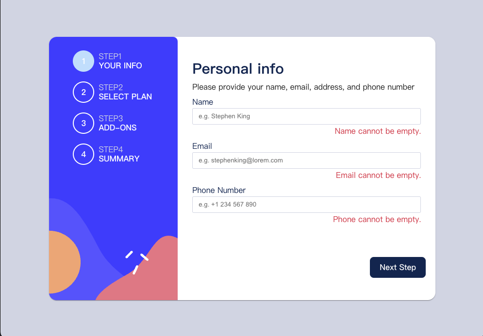

# Frontend Mentor - Multi-step form solution

This is a solution to the [Multi-step form challenge on Frontend Mentor](https://www.frontendmentor.io/challenges/multistep-form-YVAnSdqQBJ). Frontend Mentor challenges help you improve your coding skills by building realistic projects.

## Table of contents

- [Overview](#overview)
  - [The challenge](#the-challenge)
  - [Screenshot](#screenshot)
  - [Links](#links)
- [My process](#my-process)
  - [Built with](#built-with)
  - [Build Process](#build-process)
  - [Continued development](#continued-development)
- [Author](#author)

**Note: Delete this note and update the table of contents based on what sections you keep.**

## Overview

### The challenge

Users should be able to:

- Complete each step of the sequence
- Go back to a previous step to update their selections
- See a summary of their selections on the final step and confirm their order
- View the optimal layout for the interface depending on their device's screen size
- See hover and focus states for all interactive elements on the page
- Receive form validation messages if:
  - A field has been missed
  - The email address is not formatted correctly
  - A step is submitted, but no selection has been made

### Screenshot

### Links

- Solution URL: [https://github.com/Chious/multiple-step-form](https://github.com/Chious/multiple-step-form)
- Live Site URL: [https://playful-figolla-578703.netlify.app](https://playful-figolla-578703.netlify.app)

## My process

### Built with

- Semantic HTML5 markup
- CSS custom properties
- [React](https://reactjs.org/) - JS library
- [MUI](https://mui.com) - UI frame work

### Build Process

1. Define needed component & state in `useConetxt` (2hr)

2. Finished `Stepper` and `StepController` (1hr)

- `StepController` should add or minous the `stage` conditionally
- check if `stageValid` is `true`. If not, `button` should not trigger

2. Finished `Step1` to `Step4` (2hr)

- should check if form is valid and return value to `stageValid`

4. enable `cartInfo` and `setCartInfo` access to `Step1` ~ `Step4` (2hr)

5. Design view for desktop (2hr)

### What did I learn?

- first time to try RWD for mobile and desktop in the same time.

### Continued development

- since some of css change conditionally, I should define css in the component rather than in `css` file.
- MUI style setting should edit in `themeProvider` rather than in inline .

## Author

- Github - [Chious](https://github.com/Chious)
- Frontend Mentor - [@Chious](https://www.frontendmentor.io/profile/Chious)
